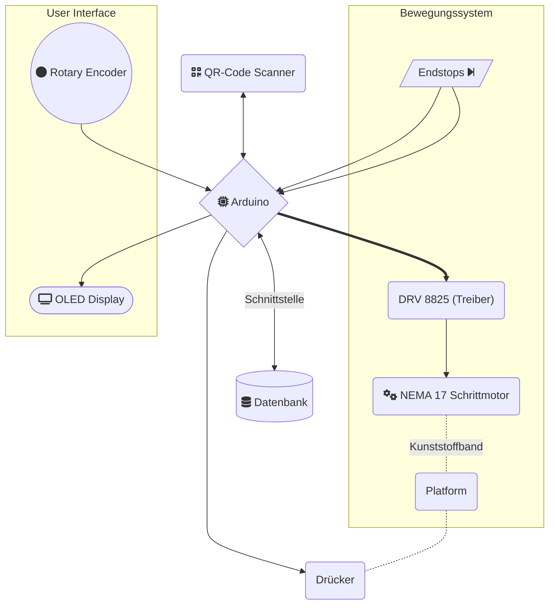

Projekt-Titel: **Automatisiertes Kommissionierungssystem**
Projektleiter: Lukas GREGOR
weitere Teilnehmer: Philip PLEVA
Projektbetreuer: Ahmet KILIC


<div style = "page-break-after: always;"></div>

# Verzeichnis

- [Verzeichnis](#verzeichnis)
- [Projektbeschreibung](#projektbeschreibung)
- [Arbeitsumfang](#arbeitsumfang)
	- [Lineares Bewegungssystem](#lineares-bewegungssystem)
		- [Schrittmotor Treiber DRV8825](#schrittmotor-treiber-drv8825)
			- [Modi](#modi)
			- [Implementierung](#implementierung)
		- [Schrittmotor NEMA 17](#schrittmotor-nema-17)
			- [Eigenschaften](#eigenschaften)
			- [Implementierung](#implementierung-1)
		- [Endschalter](#endschalter)
		- [Winkel](#winkel)
		- [Software](#software)
			- [Bibliotheken](#bibliotheken)
			- [stepper.h](#stepperh)
			- [Kalibrierung](#kalibrierung)
			- [Stepper-Modi](#stepper-modi)
			- [Manuelle Steuerung](#manuelle-steuerung)
	- [User Interface](#user-interface)
		- [Drehgeber](#drehgeber)


<div style = "page-break-after: always;"></div>


# Projektbeschreibung
Das **Automatisierte Automatisiertes Kommissionierungssystem** verfolgt das Ziel, den einfachen Schritt der Paketkommissionierung zu automatisieren und dadurch Geld und Zeit zu sparen. Die Größe des fertigen Projektes ist aufgrund von Ressourcen beschränkt aber es wird mit dem Hintergedanken der Skalierbarkeit entwickelt.

Kommissionierung mit der Hardware zu automatisieren ist nur eine von vielen Bereichen in dem Schrittmotor getriebene Maschinen eingesetzt werden können und der Bedarf nach solchen Systemen ist stehts wachsend.


# Arbeitsumfang
Dieser Teil der Diplomarbeit beschäftigt sich mit der Entwicklung eines Schrittmotor getriebenen **Bewegungssystems**, dass eine Plattform entlang der Schiene bewegen kann. Auf dieser Plattform befindet sich ein QR-Code Scanner und ein Drücker die für die Erfassung und Ausgabe der Pakete zuständig sind.



*Abbildung 1: Blockdiagramm*
<div style = "page-break-before: always;"></div>

## Lineares Bewegungssystem


*Abbildung 2: Bewegungssystem*

<div style = "page-break-before: always;"></div>

### Schrittmotor Treiber DRV8825
[DRV8825 Schrittmotor Treiber Datenblatt](https://www.tme.eu/Document/1dd18faf1196df48619105e397146fdf/POLOLU-2133.pdf)

Der DRV8825 bietet eine Lösung für die Ansteuerung von bipolaren Schrittmotoren. Der Treiber ist in der Lage, einen Strom von 2,5A zu steuern.
Der DRV8825 IC ermöglicht über nur 2 Anschlusspins (**DIR, STEP**) eine vereinfachte Kommunikation mit dem Schrittmotor.
Durch Verwendung weiterer Pins lassen sich verschiedene Modi des Treibers konfigurieren.
Ein weiterer Vorteil den der Motor Treiber liefert ist eine eingebaute Strom-Begrenzungs-Schaltung die in der Prototypenphase versagen des Treibers verhindert. 
<br>
#### Modi
|PIN|BESCHREIBUNG|
|---|---|
|DIR|Gibt die Richtung an, in die sich der Motor bewegt|
|STEP|Eine positive Taktflanke löst den nächsten Schritt aus|
|nENABLE|Schaltet den Treiber aus. Immer HIGH, außer es ist eine Bewegung des Motors erforderlich.|
|M0|Steuerung des Schrittmotor-Betriebes|
|M1|Steuerung des Schrittmotor-Betriebes|
|M2|Steuerung des Schrittmotor-Betriebes|
<br>

Über den Zustand des **DIR**-PIN wird die Richtung, in die sich der Motor dreht gesteuert. Eine positive Taktflanke auf dem **STEP**-PIN erziehlt einen Schritt in die jeweilige Richtung. Die Drehgeschwindigkeit ergibt sich dadurch aus der Frequenz, mit der positive Taktflanken auf dem **STEP**-PINs geschehen. 

Von den Modi **nSLEEP** und **nRESET** wird kein Gebrauch gemacht. Sie müssen allerdings permanent auf HIGH gesetzt werden, um die Funktion des Treibers zu ermöglichen.

Durch Verwendung Pins(**M0, M1, M2**) lässt sich die Steuerung des Stepper-Betriebes konfigurieren wodurch sich ein optimierter Betriebsmodus auswählen lässt. 

In der unveränderten, für den Steppermotor geschriebene Software wird ausschließlich der **32 microstep-Betrieb** und der **1/4 step-Betrieb** verwendet. Der **32 microstep-Betrieb** ermöglicht eine möglichst präzise Positionsauflösung bei Kalibrierung des Bewegungssystems. Die Geschwindigkeit ist dabei nicht von Priorität.

Der **1/4 step-Betrieb** ist optimal für den regulären Betrieb des Bewegungssystems da eine hohe Geschwindigkeit erzielt werden kann, ohne Fehler zu riskieren, die bei zu niedrigen Schrittmotor-Betrieben vorkommen können und den Motor zum Halten verleiten.

#### Implementierung
Beim Anschaltvorgang kann es vorallem bei langen Leitungen zu hohen Spitzenspannungen kommen welche gefährlich für die auf dem eingebauten Keramikkondesatoren sind. Als Sicherheitsmaßnahme wird so knapp wie möglich an der Versorgungsspannung ein ELKO eingebaut der laut Hersteller mindestens 47uF haben soll.


*Abbildung 4: DRV8825 Treiber*
<br>

*Abbildung 5: Betriebsmodi Tabelle*

Die Tabelle zeigt alle wählbaren Betriebsmodi für den Steppermotor und welche Ausgänge angesteuert werden müssen um die gewünschte Konfiguration einzustellen.

<div style = "page-break-before: always;"></div>

### Schrittmotor NEMA 17
Der NEMA 17 ist ein kompakter Schrittmotor der für gewöhnlich in 3D-Druckern, CNC-Maschinen und anderen Bewegungssystemen verwendet wird. Im Fullstep-Betrieb braucht der Motor 200 Steps um eine Umdrehung durchzuführen. 
$$Schrittwinkel = \frac{360\degree}{200steps} = 1.8\degree/step$$

Diese Auflösung ist für unsere Anwendung ausreichend. Über eine Veränderung im Betriebsmodus lässt sich auf Bedarf eine noch bessere Auflösung von $Schrittwinkel = \frac{360\degree}{6400steps} = 0,05625\degree/step$ bei 32-microstepping erzielen.

#### Eigenschaften
| Spezifikation   | Wert        |
| --------------- | ----------- |
| Strom           | 2A          |
| Innenwiderstand | 1,3$\Omega$ |
| Drehmoment      | 0.55Nm      |

Die Welle des Stepper-Motors über ein Kunststoffband mit der auf der Schiene laufenden Plattform verbunden. Der Motor hat 2 Phasen und somit 4 Anschlussdrähte über die er mit dem DRV8825 verbunden ist. 

#### Implementierung
Beim Beschleunigen auf hohe Umdrehungszahlen ist es möglich, dass der Schritte übersprungen werden. Der Grund dafür könnte ein nicht ausreichendes Motor-Drehmoment für den nächsten Schritt oder oder die Trägheit des Motors sein. Dieses Problem lässt sich verhindern, indem man die Spannungsversorgung erhöht oder die Strecke die der Motor für einen Schritt benötigt(Schrittwinkel) durch die Änderung des Schrittbetriebes veringert.    
<br>


### Endschalter
Das Bewegungssystem hat 2 Endschalter, die auf beiden Winkeln installiert sind und den Bereich vorgeben, in dem sich die Plattform frei bewegen darf. Die Endschalter kommen eigentlich nur  bei der Kalibrierung zu Einsatz aber behalten ihre Funktion über den ganzen Programmablauf bei um sicher zu stellen, dass bei Fehlern die Plattform nicht über die physikalischen Grenzen fährt und Teile des Systems oder sich selbst beschädigt. 
Die Endschalter werden in der NC (Normaly Closed) Konfiguration angeschlossen um vorbeugend Defekt bei Drahtbruch zu verhindern. Bei der Konfiguration der Endschalter mit dem Befehl `pinmode(endstop_pin,INPUT_PULLUP)`wird der auf der Arduino-Platine enthaltene Pullup-Widerstand dazu geschalten.
<br>

### Winkel
Der Winkel der als Verbindung zwischen Boden und der Schiene dient wurde selbständig designed und gefertigt um Anforderungen zu treffen und Endschalter darauf installieren zu können. 
<br>

### Software
Die Software, die das gesamte System antreibt besteht aus einem Hauptprogramm **main.cpp**, in dem alle verwendete Bibliotheken inkludiert werden und die Befehle, die von der seriellen Schnittstelle empfangen werden, abgearbeitet werden.


	

#### Bibliotheken
Das Projekt verwendet über 2. Wesentliche Bibliotheken.
Die erste ist die **<Adafruit_SSD1306.h>** Bibliothek, die die Kommunikation mit dem OLED-Display vereinfacht und Unterprogramme enthält, die das designen und programmieren des **User-Interface** erleichtern. Die für die Ansteuerung des Motors zuständige Bibliothek ist **"stepper.h"**.Sie ist mit Hilfe des [Real Time Stepper Motor Linear Ramping Algorithmus](https://embdev.net/attachment/47239/LeibRamp.pdf) aufgebaut.

#### stepper.h
Die Stepper Klasse ist für den speziellen Betrieb von Schritt-Motoren mit Endschaltern geschrieben worden. Sie besteht aus Funktionen für die einfache Bedienung des Schritt-Motors, die Einstellung und Änderung des Bewegungs-Profils und der Kalibrierung des Bewegungssystems.

```cpp
Stepper NEMA17(2,3,4,5,6,7,20,21); // Initialization of object(NEMA17) with the class Stepper
```
Hier wird das Objekt NEMA17 mit der am Arduino verwendeten Pinbelegung initialisiert.

#### Kalibrierung

``` cpp
  NEMA17.calibration(0);
```
Die `Stepper::calibration()` Funktion ist für die Durchführung einer kompletten Kalibration. 
Diese besteht aus der 2-fachen Kalibrierungsfunktion `Stepper::calibration_direction`, welche die Option freischaltet, In nur eine Richtung zu kalibrieren.


#### Stepper-Modi
Der DRV8825 Schrittmotor-Treiber verfügt über einer Zahlreichen Auswahl an Betriebs-Modi, die durch Micro-Stepping freigeschlatet werden. Über den Befehl `Stepper::change_microstep_resolution()` kann der Betrieb gewechselt werden. 

```cpp
	int microstep_table[8][4] = 
	{{0,0,0,1},   //0 = Full-Step-Betrieb
	{1,0,0,2},    //1 = Half-Step-Betrieb
	{0,1,0,4},    //2 = 1/4-Step-Betrieb        
	{1,1,0,8},    //3 = 1/8-Step-Betrieb
	{0,0,1,16},    //4 = 1/16-Step-Betrieb
	{1,0,1,32},    //5 = 1/32-Step-Betrieb
	{0,1,1,32},    //6 = 1/32-Step-Betrieb
	{1,1,1,32}};   //7 = 1/32-Step-Betrieb
```


``` cpp
  // Microstepping-Betrieb
  digitalWrite(M2,HIGH);
```
Mit nur einem Befehl lässt sich die Betriebskonfiguration von 1/4 auf 1/32 umstellen. Siehe *Abbildung 5*.

```cpp
  // Kalibrierungssequenz
  digitalWrite(nEnable, LOW);
  stepper.calibration(-1, 16000, 200000, S1, true);
  stepper.calibration(1, 16000, 200000, S2, false);
  digitalWrite(nEnable, HIGH);
```
Mit `digitalWrite(nEnable, LOW)` wird der DRV8825 in Betrieb gesetzt. und es wird die Kalibrierungssequenz gestartet. Nachdem die Kalibrierung abgeschlossen ist, wird der PIN *nEnable* wieder HIGH gesetzt.

#### Manuelle Steuerung

``` cpp
digitalWrite(nEnable,LOW);
stepper.moveRelativeInSteps(counter - stepper.getCurrentPositionInSteps(),S1,S2);
digitalWrite(nEnable,HIGH);
```
Mit diesem Befehl bewegt sich der Motor um einen relativen Wert, der über den Drehgeber manuell eingestellt wurde in die ausgewählte Richtung. Es wird vor jedem Schritt der Zustand der Endschalter geprüft, um bei fehlerhaften Versetzungen trotzdem sofort anhalten zu können, wenn die Platform ihren zulässigen Bereich verlässt.

## User Interface

### Drehgeber
Der Drehgeber engl(Rotary Encoder) ist ein Eingabegerät, dass sich in beide Richtungen ohne uneingeschränkt drehen lässt.
Da er keinen Angschlagpunkt besitzt, ist der Drehgeber perfekt für Anwendungen geeingnet, bei denen ein bestimmten Wert einzustellen ist.


