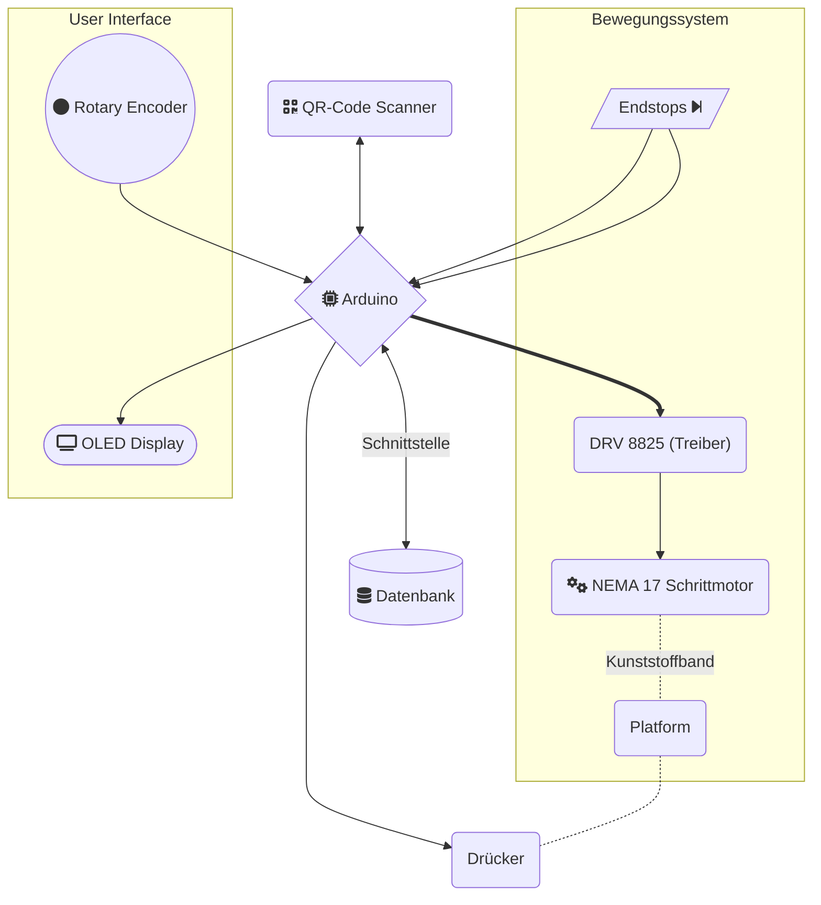

Projekt-Titel: **Automatisiertes Kommissionierungssystem**
Projektleiter: Lukas GREGOR
weitere Teilnehmer: Philip PLEVA
Projektbetreuer: Ahmet KILIC

 

# Verzeichnis

- [Verzeichnis](#verzeichnis)
- [Projektbeschreibung](#projektbeschreibung)
- [Arbeitsumfang](#arbeitsumfang)
	- [Lineares Bewegungssystem](#lineares-bewegungssystem)
		- [Schrittmotor Treiber Träger DRV8825](#schrittmotor-treiber-träger-drv8825)
			- [Modi](#modi)
			- [Implementierung](#implementierung)
		- [Schrittmotor NEMA 17](#schrittmotor-nema-17)
			- [Eigenschaften](#eigenschaften)
			- [Implementierung](#implementierung-1)
		- [Endschalter](#endschalter)
		- [Winkel](#winkel)
		- [weitere Hardware](#weitere-hardware)
		- [Software](#software)
	- [User Interface](#user-interface)

 

# Projektbeschreibung
Das **Automatisierte Automatisiertes Kommissionierungssystem** verfolgt das Ziel, den einfachen Schritt der Paketkommissionierung zu automatisieren und dadurch Geld und Zeit zu sparen. Die Größe des fertigen Projektes ist aufgrund von Ressourcen beschränkt aber es wird mit dem Hintergedanken der Skalierbarkeit entwickelt.

Kommissionierung mit der Hardware zu automatisieren ist nur eine von vielen Bereichen in dem Schrittmotor getriebene Maschinen eingesetzt werden können und der Bedarf nach solchen Systemen ist stehts wachsend.

 

# Arbeitsumfang
Dieser Teil der Diplomarbeit beschäftigt sich mit der Entwicklung eines Schrittmotor getriebenen **Bewegungssystems**, dass eine Plattform entlang der Schiene bewegen kann. Auf dieser Plattform befindet sich ein QR-Code Scanner und ein Drücker die für die Erfassung und Ausgabe der Pakete zuständig sind.

 

## Lineares Bewegungssystem

*Abbildung 3: Lineares Bewegungssystem*

 

### Schrittmotor Treiber Träger DRV8825
[DRV8825 Schrittmotor Treiber Träger Datenblatt](https://www.tme.eu/Document/1dd18faf1196df48619105e397146fdf/POLOLU-2133.pdf)

Der DRV8825 bietet eine Lösung für die Ansteuerung von bipolaren Schrittmotoren. Der Treiber ist in der Lage, einen Strom von 2,5A zu steuern.
Der DRV8825 IC ermöglicht über nur 2 Anschlusspins (**DIR, STEP**) eine vereinfachte Kommunikation mit dem Schrittmotor.
Durch Verwendung weiterer Pins lassen sich verschiedene Modi des Treibers konfigurieren.
Ein weiterer Vorteil den der Motor Treiber liefert ist eine eingebaute Strom-Begrenzungs-Schaltung die in der Prototypenphase versagen des Treibers verhindert. 

#### Modi
|PIN|BESCHREIBUNG|
|---|---|
|DIR|Gibt die Richtung an, in die sich der Motor bewegt|
|STEP|Eine positive Taktflanke löst den nächsten Schritt aus|
|nENABLE|Schaltet den Treiber aus. Immer HIGH, außer es ist eine Bewegung des Motors erforderlich.|
|M0|Steuerung des Schrittmotor-Betriebes|
|M1|Steuerung des Schrittmotor-Betriebes|
|M2|Steuerung des Schrittmotor-Betriebes|

Über den Zustand des **DIR**-PIN wird die Richtung, in die sich der Motor dreht gesteuert. Eine positive Taktflanke auf dem **STEP**-PIN erziehlt einen Schritt in die jeweilige Richtung. Die Drehgeschwindigkeit ergibt sich dadurch aus der Frequenz, mit der positive Taktflanken auf dem **STEP**-PINs geschehen. 

Von den Modi **nSLEEP** und **nRESET** wird kein Gebrauch gemacht. Sie müssen allerdings permanent auf HIGH gesetzt werden, um die Funktion des Treibers zu ermöglichen.

Durch Verwendung Pins(**M0, M1, M2**) lässt sich die Steuerung des Stepper-Betriebes konfigurieren wodurch sich ein optimierter Betriebsmodus auswählen lässt. 

In der unveränderten, für den Steppermotor geschriebene Software wird ausschließlich der **32 microstep-Betrieb** und der **1/4 step-Betrieb** verwendet. Der **32 microstep-Betrieb** ermöglicht eine möglichst präzise Positionsauflösung bei Kalibrierung des Bewegungssystems. Die Geschwindigkeit ist dabei nicht von Priorität.
Der **1/4 step-Betrieb** ist optimal für den regulären Betrieb des Bewegungssystems da eine hohe Geschwindigkeit erzielt werden kann, ohne Fehler zu riskieren, die bei zu niedrigen Schrittmotor-Betrieben vorkommen können und den Motor zum Halten verleiten.

#### Implementierung
Beim Anschaltvorgang kann es vorallem bei langen Leitungen zu hohen Spitzenspannungen kommen welche gefährlich für die auf dem Träger eingebauten Keramikkondesatoren sind. Als Sicherheitsmaßnahme wird so knapp wie möglich an der Versorgungsspannung ein ELKO eingebaut der laut Hersteller mindestens 47uF haben soll.

*Abbildung 3: DRV8825 Treiber*

*Abbildung 4: Betriebsmodi Tabelle*

Die Tabelle zeigt alle wählbaren Betriebsmodi für den Steppermotor und welche Ausgänge angesteuert werden müssen um die gewünschte Konfiguration einzustellen.

### Schrittmotor NEMA 17
Der NEMA 17 ist ein kompakter Schrittmotor der für gewöhnlich in 3D-Druckern, CNC-Maschinen und anderen Bewegungssystemen verwendet wird. Im Fullstep-Betrieb braucht der Motor 200 Steps um eine Umdrehung durchzuführen. 
$$Schrittwinkel = \frac{360\degree}{200steps} = 1.8\degree/step$$

Diese Auflösung ist für unsere Anwendung ausreichend. Über eine Veränderung im Betriebsmodus lässt sich auf Bedarf eine noch bessere Auflösung von $Schrittwinkel = \frac{360\degree}{6400steps} = 0,05625\degree/step$ bei 32-microstepping erzielen.

#### Eigenschaften
| Spezifikation   | Wert        |
| --------------- | ----------- |
| Strom           | 2A          |
| Innenwiderstand | 1,3$\Omega$ |
| Drehmoment      | 0.55Nm      |

Die Welle des Stepper-Motors über ein Kunststoffband mit der auf der Schiene laufenden Plattform verbunden. Der Motor hat 2 Phasen und somit 4 Anschlussdrähte über die er mit dem DRV8825 verbunden ist. 

#### Implementierung
Beim Beschleunigen auf hohe Umdrehungszahlen ist es möglich, dass der Schritte übersprungen werden. Der Grund dafür könnte ein nicht ausreichendes Motor-Drehmoment für den nächsten Schritt oder oder die Trägheit des Motors sein. Dieses Problem lässt sich verhindern, indem man die Spannungsversorgung erhöht oder die Strecke die der Motor für einen Schritt benötigt(Schrittwinkel) durch die Änderung des Schrittbetriebes veringert.    

### Endschalter
Das Bewegungssystem hat 2 Endschalter, die auf beiden Winkeln installiert sind und den Bereich vorgeben, in dem sich die Plattform frei bewegen darf. Die Endschalter kommen eigentlich nur  bei der Kalibrierung zu Einsatz aber behalten ihre Funktion über den ganzen Programmablauf bei um sicher zu stellen, dass bei Fehlern die Plattform nicht über die physikalischen Grenzen fährt und Teile des Systems oder sich selbst beschädigt. 
Die Endschalter werden in der NC (Normaly Closed) Konfiguration angeschlossen um vorbeugend Defekt bei Drahtbruch zu verhindern.
### Winkel
Der Winkel der als Verbindung zwischen Boden und der Schiene dient wurde selbständig designed und gefertigt um Anforderungen zu treffen und Endschalter darauf installieren zu können. 

### weitere Hardware

### Software
[Beschleunigung Rampen Algorithmus](https://embdev.net/attachment/47239/LeibRamp.pdf)

## User Interface

