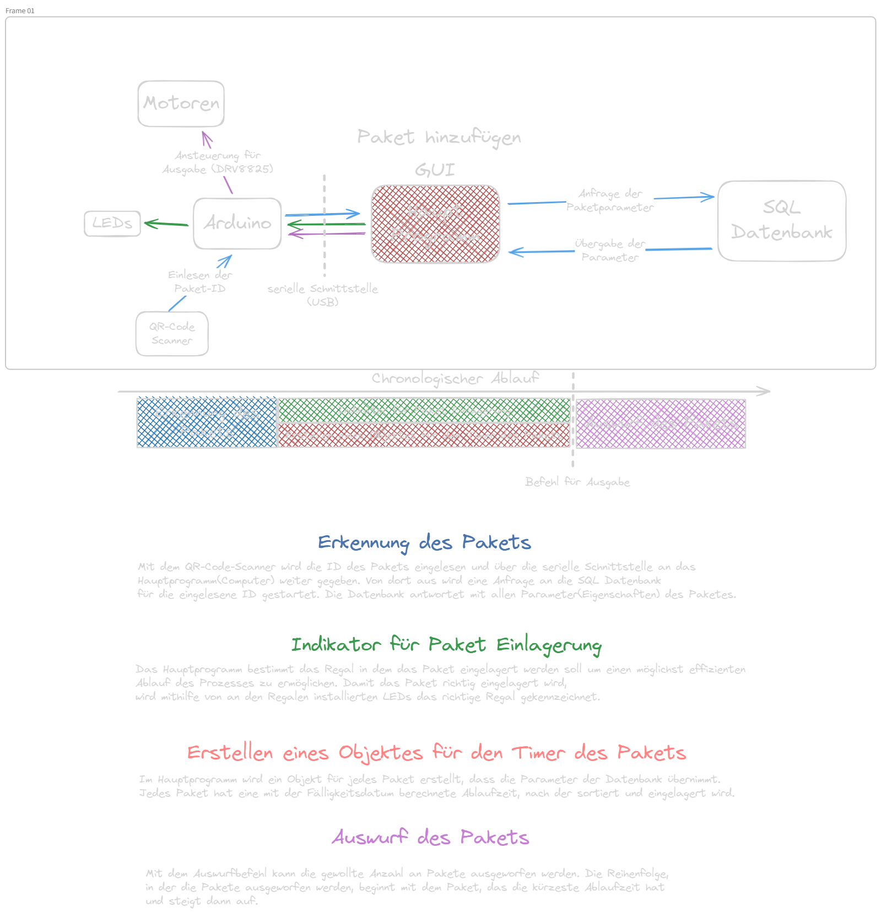

# AKS

Große Produktionsunternehmen stoßen oft auf das Problem, dass durch dessen Wachstum die Produktion immer größer und unübersichtlicher wird. Dadurch treten öfters Fehler auf, die das Unternehmen Geld kosten.
Das **AKS (Automatisiertes Kommissionierungssystem)** ist ein Projekt mit dem Ziel, die Effizienz in Lagern zu erhöhen und für Übersicht mithilfe digitaler Dokumentation zu führen.

Das fertige Produkt soll folgende Eigenschaften haben:
- Kostengünstig
- einfach in der Produktion
- ausfallsichere redundante Software
- Leistungsstark (schnell)

# To-do
- [ ] PCB designen
- [ ] CAD designen
- [ ] Hardware bestellen

